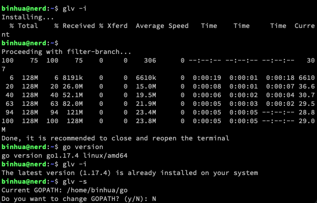
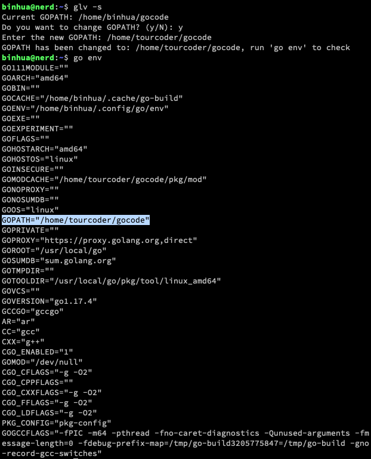

# GLV

Golang Latest Version

### Intro

`glv` is a simple bash script to manage Go versions and GOPATH settings.

### Install

```
curl https://raw.githubusercontent.com/tourcoder/glv/master/glv | bash
```

### How to use

```
Usage: glv [OPTION]...
Options:
  -i, --install      Install/Update Golang
  -s, --setgopath    Set GOPATH
  -h, --help         Show help information
  -v, --version      Show GLV version
```





### How to Collaborate

Please feel free to submit your PR or issue.

### Copyright

[MIT](LICENSE)

